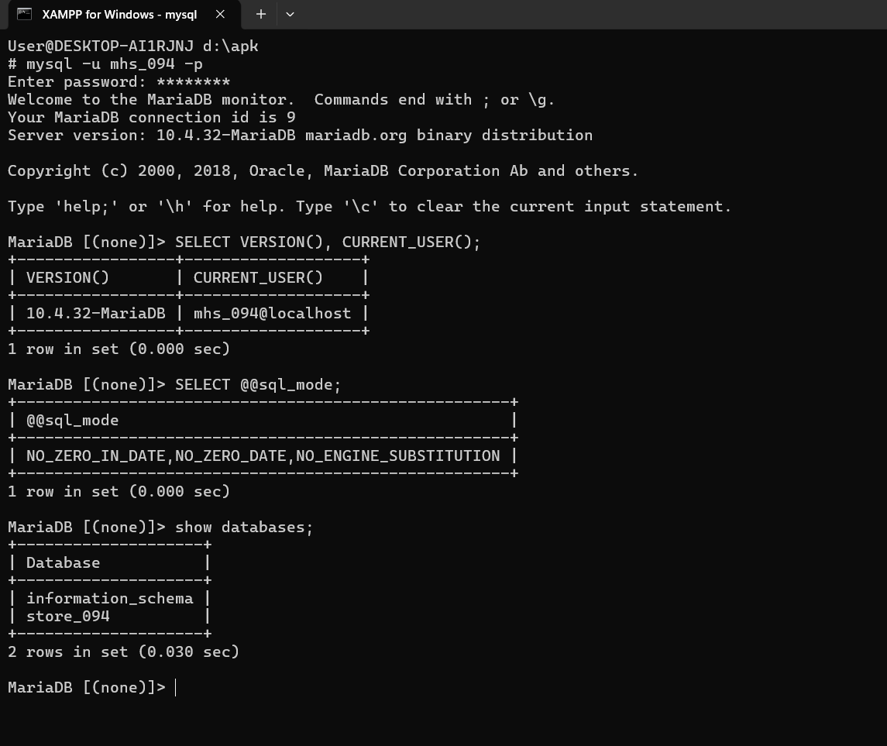
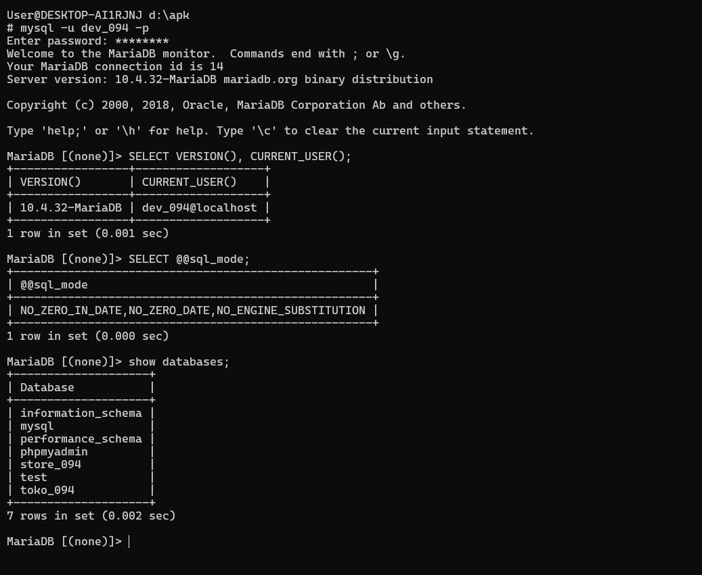
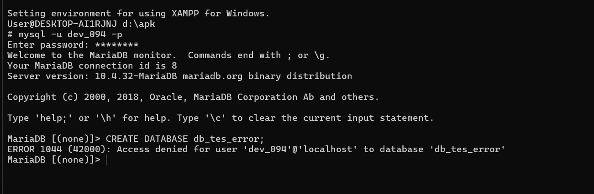
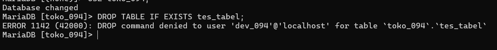
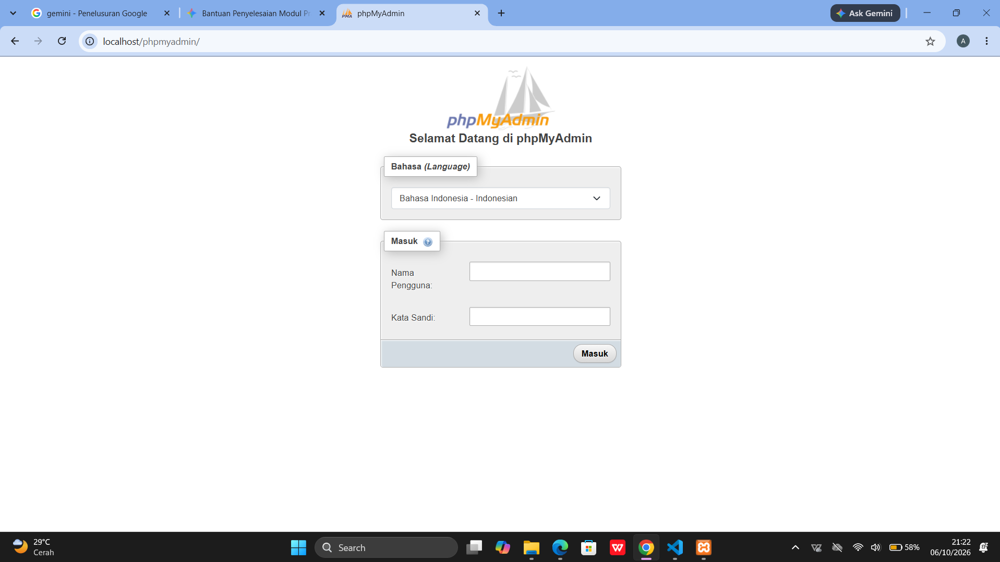
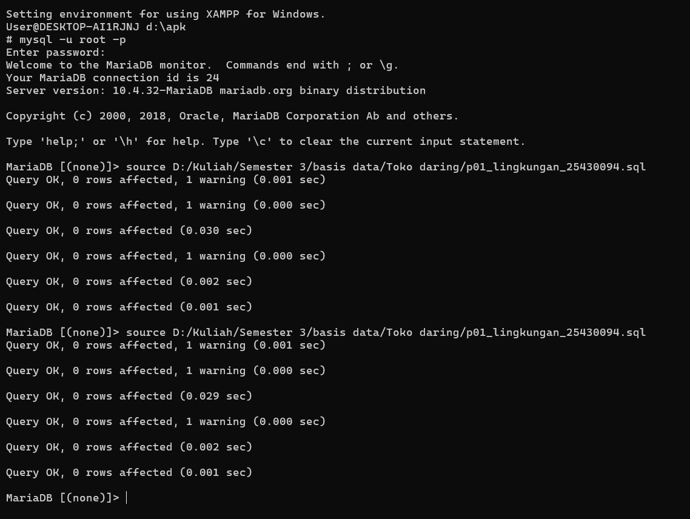
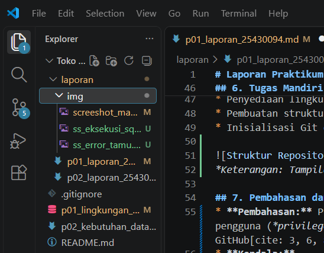
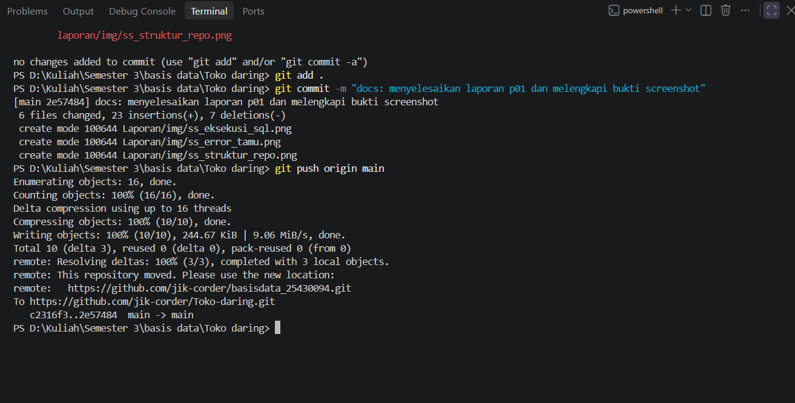

# Laporan Praktikum Basis Data - Pertemuan 01
**Nama:** Abizar Gavra Andika  
**NPM:** 25430094  
**Kelas:** D Ilmu Komputer  
**Tanggal:** 4 Oktober 2026  
**Dosen Pengampu:** Dedi Irawan, S.Kom., M.T.I.  
**Pertemuan:** 1

---

## 1. Tujuan Praktikum
* Memahami konsep dasar sistem manajemen basis data (DBMS) dan arsitektur MariaDB.
* Mampu menyiapkan dan mengonfigurasi lingkungan kerja database menggunakan XAMPP dan MariaDB Shell.
* Menguasai perintah dasar SQL untuk mengelola database dan hak akses pengguna sesuai prinsip *least privilege*.
* Mengintegrasikan direktori kerja proyek lokal dengan repositori GitHub.

---

## 2. Ringkasan Dasar Teori
* **DBMS & Relational Database:** Sistem perangkat lunak yang digunakan untuk menyimpan, mengelola, dan memanggil data secara terstruktur dalam bentuk tabel-tabel terelasi.
* **MariaDB & XAMPP:** MariaDB merupakan sistem manajemen basis data relasional open-source. XAMPP menyediakan paket server lokal yang mengintegrasikan Apache, MariaDB, PHP, dan Perl.
* **SQL & Manajemen Hak Akses:** Bahasa standar untuk berinteraksi dengan database (DDL, DML, DCL). MariaDB mengelola pengguna dengan format `'user'@'host'` menggunakan perintah `GRANT` dan `REVOKE`.
* **Prinsip Least Privilege & Idempotency:** Pengguna diberikan hak akses minimal sesuai fungsinya, dan skrip SQL dirancang *idempotent* agar aman dijalankan berulang kali tanpa memicu galat duplikasi.

---

## 3. Hasil Langkah Percobaan

### A. Pengecekan Lingkungan Praktikum & User Utama (`mhs_094`)
Pengujian verifikasi versi MariaDB, user aktif, `sql_mode`, dan daftar database pada akun `mhs_094`.

*Keterangan: Pengujian verifikasi user mhs_094 pada MariaDB Shell.*

---

### B. Verifikasi Hak Akses User Pengembang (`dev_094`)
Pengujian verifikasi versi MariaDB, user aktif, `sql_mode`, dan daftar database pada akun `dev_094`.

*Keterangan: Pengujian verifikasi user dev_094 pada MariaDB Shell.*

---

### C. Pengujian Pembatasan Hak Akses & Kode Galat (Error 1044 & 1142)
1. **Pengujian Galat 1044:** Memicu galat saat user `dev_094` mencoba membuat database baru (`CREATE DATABASE db_tes_error;`).
2. **Pengujian Galat 1142:** Memicu galat saat user `dev_094` mencoba menghapus/membuat tabel (`DROP TABLE toko_094.tes_tabel;`).

*Keterangan: Pesan ERROR 1044 penolakan pembuatan database oleh user dev_094.*

*Keterangan: Pesan ERROR 1142 penolakan perintah tingkat tabel oleh user dev_094.*

---

### D. Konfigurasi phpMyAdmin Mode `cookie`
Pengaturan berkas `config.inc.php` pada folder `D:\apk\phpMyAdmin\` menggunakan `$cfg['Servers'][$i]['auth_type'] = 'cookie';` untuk memastikan keamanan autentikasi interaktif.

*Keterangan: Tampilan halaman login phpMyAdmin dengan autentikasi mode cookie.*

---

## 4. Jawaban Titik Analisis

1. **Titik Analisis 1: Pentingnya Idempotensi Skrip SQL**  
   *Jawaban:* Skrip SQL harus dirancang *idempotent* (menggunakan klausul `CREATE DATABASE IF NOT EXISTS` dan `DROP USER IF EXISTS`) agar aman dieksekusi berulang kali pada lingkungan pengembangan maupun produksi tanpa memicu galat duplikasi objek atau merusak hak akses yang telah dikonfigurasi.

2. **Titik Analisis 2: Penerapan Prinsip Least Privilege pada Akun `dev_094`**  
   *Jawaban:* Menggunakan akun `root` secara terus-menerus sangat berisiko karena memiliki akses penuh tanpa batas. Pembuatan user `dev_094` dengan hak akses terbatas (hanya `SELECT`) meminimalisir risiko kerusakan data atau modifikasi struktur database (*DDL*) secara tidak sengaja oleh pihak pengembang/tamu.

3. **Titik Analisis 3: Keamanan Autentikasi phpMyAdmin Mode `cookie`**  
   *Jawaban:* Mode `cookie` mewajibkan pengguna memasukkan nama pengguna dan kata sandi setiap kali membuka sesi browser melalui formulir login. Hal ini jauh lebih aman dibandingkan mode `config` yang menyimpan kata sandi secara terbuka (*plain text*) di dalam berkas konfigurasi server.

4. **Titik Analisis 4: Perbedaan dan Penanganan Kode Galat (Error 1044, 1045, 1142)**  
   *Jawaban:* DBMS memisahkan kode galat untuk mempermudah identifikasi masalah keamanan:
   * **ERROR 1045 (28000):** Galat **Autentikasi** (nama pengguna atau kata sandi salah saat login).
   * **ERROR 1044 (42000):** Galat **Otorisasi Database** (pengguna berhasil login, tetapi tidak memiliki izin membuat/mengakses database tertentu).
   * **ERROR 1142 (42000):** Galat **Otorisasi Perintah/Tabel** (pengguna berhasil mengakses database, tetapi dilarang menjalankan perintah spesifik seperti `INSERT`, `UPDATE`, atau `DROP` pada tabel tertentu).

---

## 5. Hasil Latihan dan Modifikasi

### Pembuatan Skrip SQL Idempotent (`p01_lingkungan_25430094.sql`):
* Menyusun skrip pengondisian pembuatan database `toko_094` serta pengaturan hak akses user `mhs_094` dan `dev_094`.
* Melakukan eksekusi berulang kali menggunakan perintah `source` di MariaDB Shell untuk memastikan skrip bersifat idempotent.

*Keterangan: Hasil sukses eksekusi skrip SQL p01_lingkungan_25430094.sql di MariaDB Shell.*

---

## 6. Tugas Mandiri: Milestone Proyek 01
* Penyediaan lingkungan kerja basis data menggunakan MariaDB/XAMPP.
* Pembuatan struktur direktori repositori proyek di VS Code beserta berkas `.gitignore`.
* Inisialisasi Git dan pengunggahan commit perdana ke GitHub.

*Keterangan: Tampilan struktur direktori proyek pada VS Code.*

---

## 7. Pembahasan dan Kendala
* **Pembahasan:** Praktikum Modul 1 berfokus pada persiapan lingkungan kerja MariaDB, pengelolaan hak akses pengguna (*privileges*) `mhs_094` dan `dev_094`, pembuatan skrip SQL yang *idempotent*, pengujian mode autentikasi phpMyAdmin, serta pengintegrasian berkas kerja ke repositori GitHub[cite: 1, 3, 6].
* **Kendala:** 
  1. Terjadi galat `ERROR 1396 (HY000)` saat mencoba mengubah nama user menggunakan perintah `RENAME USER` karena user asal tidak ditemukan atau sudah terhapus.
  2. Terjadi penolakan operator *redirection* (`<`) saat mengeksekusi berkas `.sql` melalui PowerShell di Terminal VS Code.
  3. Terjadi galat penelusuran lokasi berkas (`Failed to open file error: 2`) saat menjalankan perintah `source` karena perbedaan direktori aktif terminal[cite: 5].
* **Solusi:**
  1. Memeriksa keberadaan user dengan `SELECT User, Host FROM mysql.user;` lalu mengeksekusi `DROP USER IF EXISTS` sebelum membuat ulang user menggunakan `CREATE USER`.
  2. Menggunakan perintah `source` secara langsung di dalam MariaDB Shell dengan mencantumkan jalur lokasi berkas (*absolute path*) secara lengkap[cite: 5].
  3. Menggunakan sintaks `type p01_lingkungan_25430094.sql | mysql -u root -p` pada Shell XAMPP / CMD[cite: 6].

---

## 8. Kesimpulan
Pada praktikum Modul 1 ini, instalasi dan konfigurasi lingkungan kerja basis data menggunakan XAMPP dan MariaDB telah berhasil dilakukan. Pengujian pembatasan hak akses user `mhs_094` dan `dev_094`, penanganan galat 1044 & 1142, konfigurasi phpMyAdmin mode `cookie`, serta pembuatan skrip SQL idempotent `p01_lingkungan_25430094.sql` berjalan sukses tanpa hambatan. Pengintegrasian repositori lokal ke GitHub juga sudah berjalan dengan baik.

---

## 9. Pernyataan Penggunaan AI
Saya menyatakan memanfaatkan AI (Gemini) sebatas kawan diskusi untuk mengecek format penulisan Markdown, menganalisis kode galat, dan merapikan struktur dokumen. Seluruh pengerjaan dan pemahaman isi laporan ini tetap dilakukan sendiri.

---

## 10. Bukti Git & Keaslian
* **Tautan Repositori:** https://github.com/jik-corder/basisdata_25430094
* **Hash Commit:** `3411fc4`
* **Pesan Commit:** `p01: Penyiapan lingkungan basis data dan hak akses pengguna`
* **Pernyataan Keaslian:** Seluruh tangkapan layar (screenshot) memperlihatkan akun ber-NIM (`mhs_094` dan `dev_094`), jam sistem aktif, serta nama objek yang memuat NIM/inisial (`toko_094` dan `25430094`).

*Keterangan: Bukti perintah Git Push sukses terunggah ke repositori GitHub.*

---

## Tabel P.13 Checklist Umum Laporan Praktikum

| Check | Butir | Yang Harus Ada |
| :---: | :--- | :--- |
| [x] | **Identitas** | Nama, NIM, kelas, pertemuan ke-1, tanggal pelaksanaan, nama asisten/dosen |
| [x] | **Tujuan** | Tujuan praktikum ditulis ulang dengan bahasa sendiri (maksimal 5 baris) |
| [x] | **Ringkasan Teori** | Pemahaman sendiri atas Dasar Teori, maksimal setengah halaman, tanpa menyalin buku |
| [x] | **Langkah Percobaan (D)** | Tangkapan layar hasil langkah kunci sesuai checklist khusus, masing-masing diberi keterangan singkat |
| [x] | **Titik Analisis** | Semua Titik Analisis dijawab lengkap dengan alasan, bukan sekadar ya/tidak |
| [x] | **Latihan (E)** | Skrip/dokumen hasil latihan beserta bukti berjalan |
| [x] | **Tugas Mandiri (F)** | Milestone proyek pertemuan ini: berkas, bukti, dan penjelasan keputusan desain |
| [x] | **Pembahasan dan Kendala** | Galat yang ditemui, cara membacanya, dan cara mengatasinya |
| [x] | **Kesimpulan** | Dua sampai empat kalimat dengan bahasa sendiri |
| [x] | **Pernyataan Penggunaan AI** | Alat yang dipakai, untuk apa, bagian mana; tulis "tidak menggunakan" bila tidak memakai |
| [x] | **Bukti Git** | Tautan repositori dan kode *commit* (hash) pertemuan ini dengan pesan `p01: ...` |
| [x] | **Keaslian** | Setiap tangkapan layar memperlihatkan akun ber-NIM dan jam sistem; nama objek memuat NIM/inisial |

---

## Checklist Kelengkapan Berkas
- [x] Berkas diberi nama sesuai format `laporan/p01_laporan_25430094.md`
- [x] Struktur laporan sesuai dengan kerangka baku tanpa mengubah urutan bagian
- [x] Semua tugas mandiri dan persiapan lingkungan telah diselesaikan
- [x] Perubahan telah di-commit dan di-push ke GitHub