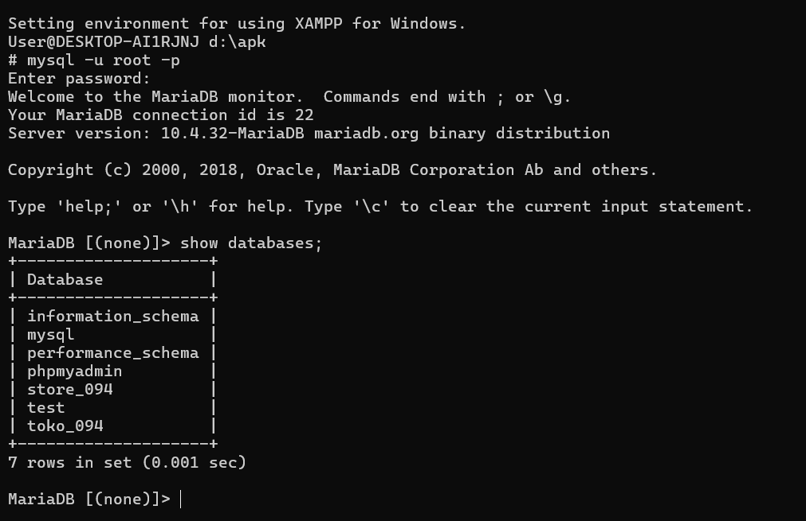

# Laporan Praktikum Basis Data - Pertemuan 01
**Nama:** Abizar Gavra Andika  **NIM:** 25430094  **Kelas:** Ilmu Komputer  **Tanggal:** 4 Oktober 2026

## 1. Tujuan Praktikum
* Memahami konsep dasar sistem manajemen basis data (DBMS) dan arsitektur MariaDB.
* Mampu menyiapkan dan mengonfigurasi lingkungan kerja database menggunakan XAMPP dan MariaDB Shell.
* Menguasai perintah dasar SQL untuk mengelola database dan hak akses pengguna.
* Mengintegrasikan direktori kerja proyek lokal dengan repositori GitHub.

## 2. Ringkasan Dasar Teori
* **DBMS & Relational Database:** Sistem perangkat lunak yang digunakan untuk menyimpan, mengelola, dan memanggil data secara terstruktur dalam bentuk tabel-tabel terelasi.
* **MariaDB & XAMPP:** MariaDB merupakan sistem manajemen basis data relasional open-source. XAMPP menyediakan paket server lokal yang mengintegrasikan Apache, MariaDB, PHP, dan Perl.
* **SQL (Structured Query Language):** Bahasa standar untuk berinteraksi dengan database, terbagi menjadi DDL (Data Definition Language), DML (Data Manipulation Language), dan DCL (Data Control Language).

## 3. Hasil Langkah Percobaan
### Pengecekan Lingkungan Praktikum

*Keterangan: Pengujian koneksi awal ke layanan MariaDB melalui Shell XAMPP.*

## 4. Jawaban Titik Analisis
1. **Mengapa penting menggunakan kredensial khusus dan tidak selalu menggunakan akun `root`?**  
   *Jawaban:* Menggunakan akun `root` secara terus-menerus sangat berisiko dari segi keamanan karena memiliki hak akses tanpa batas. Pembuatan akun pengguna khusus dengan hak akses terbatas dapat meminimalisir risiko kerusakan data atau akses yang tidak sah.
2. **Apa fungsi dari file `.gitignore` dalam repositori Git?**  
   *Jawaban:* File `.gitignore` berfungsi untuk memberi tahu Git berkas atau folder mana saja yang tidak perlu dilacak dan tidak boleh diunggah ke GitHub, seperti file konfigurasi sensitif, log, atau folder temporary.

## 5. Hasil Latihan dan Modifikasi
* Mengonfigurasi lingkungan awal MariaDB pada XAMPP.
* Membuat struktur repositori proyek `basisdata_25430094` yang rapi sesuai dengan panduan praktikum.

## 6. Tugas Mandiri: Milestone Proyek 01
* Penyediaan lingkungan kerja basis data menggunakan MariaDB/XAMPP.
* Pembuatan struktur direktori repositori proyek di VS Code beserta konfigurasinya.
* Inisialisasi Git dan pengunggahan commit perdana ke GitHub.

## 7. Pembahasan dan Kendala
* **Pembahasan:** Praktikum Modul 1 fokus pada persiapan lingkungan kerja dan pengenalan alat bantu yang digunakan selama perkuliahan basis data.
* **Kendala:** Sempat ada sedikit kebingungan terkait struktur nama repositori di GitHub.
* **Solusi:** Mengubah nama repositori di GitHub menjadi `basisdata_25430094` agar sesuai dengan instruksi.

## 8. Kesimpulan
Pada praktikum Modul 1 ini, instalasi dan konfigurasi lingkungan kerja basis data menggunakan XAMPP dan MariaDB telah berhasil dilakukan. Pengintegrasian repositori lokal ke GitHub juga sudah berjalan dengan baik.

## 9. Pernyataan Penggunaan AI
Saya menyatakan memanfaatkan AI (Gemini) sebatas kawan diskusi untuk mengecek format penulisan Markdown dan merapikan struktur dokumen. Seluruh pengerjaan dan pemahaman isi laporan ini tetap dilakukan sendiri.

## 10. Bukti Git
* **Tautan Repositori:** https://github.com/jik-corder/basisdata_25430094
* **Hash Commit:** `e965870`

## Checklist
- [x] Berkas diberi nama sesuai format `laporan/p01_laporan_25430094.md`
- [x] Struktur laporan sesuai dengan kerangka baku tanpa mengubah urutan bagian
- [x] Semua tugas mandiri dan persiapaan lingkungan telah diselesaikan
- [x] Perubahan telah di-commit dan di-push ke GitHub